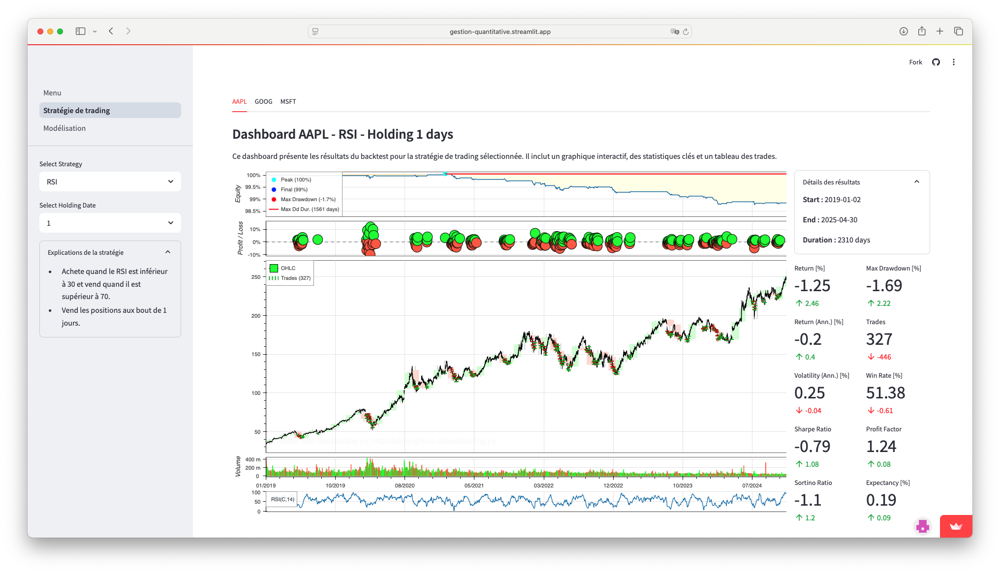
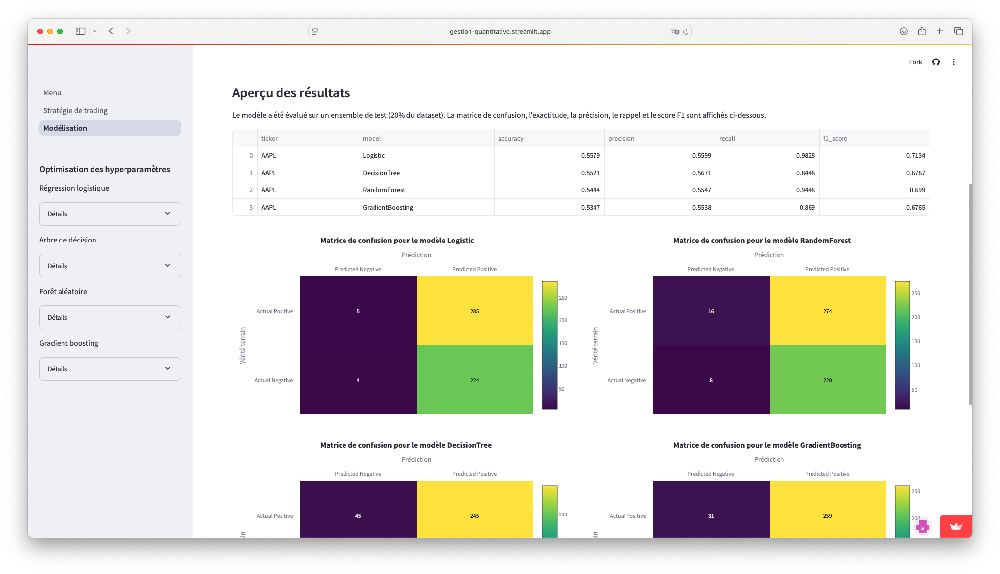

# Gestion Quantitative

Ce projet a pour objectif de développer, tester et analyser des stratégies de trading algorithmique à l'aide de données financières et d'outils de modélisation quantitative.

**Accédez à la version déployée : [gestion-quantitative.streamlit.app](https://gestion-quantitative.streamlit.app)**

## Visualisation des interfaces

### Vue "Stratégies"


### Vue "Modélisation"


## Structure du projet

- `Menu.py` : Point d'entrée principal du projet.
- `data/` : Données brutes, préparées et résultats des modèles.
- `models/` : Modèles entraînés (format ONNX).
- `notebook/` : Notebooks Jupyter pour l'exploration, le backtesting et la modélisation.
- `pages/` : Scripts pour l'interface utilisateur ou la présentation des résultats.
- `docs/` : Documentation et ressources supplémentaires.
- `secret.py.example` : Exemple de fichier de configuration pour les clés API.

## Utilisation

- Lancez le menu principal :
  ```bash
  python -m streamlit run Menu.py
  ```
- Modifiez `secret.py` pour ajouter vos clés API (voir `secret.py.example`).

## Fonctionnalités principales

- Backtesting de stratégies de trading (Bollinger, Momentum, Chaikin, Credit Spread, etc.)
- Modélisation prédictive (arbres de décision, forêts aléatoires, régression logistique, etc.)
- Génération de rapports de performance (CSV, HTML)
- Organisation claire des résultats et des données
- Notebooks pour l'analyse exploratoire et la modélisation
